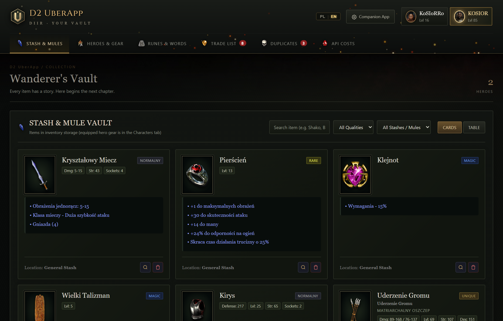
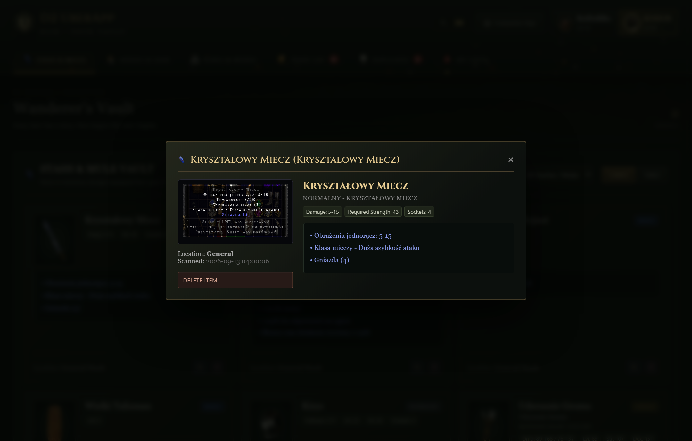
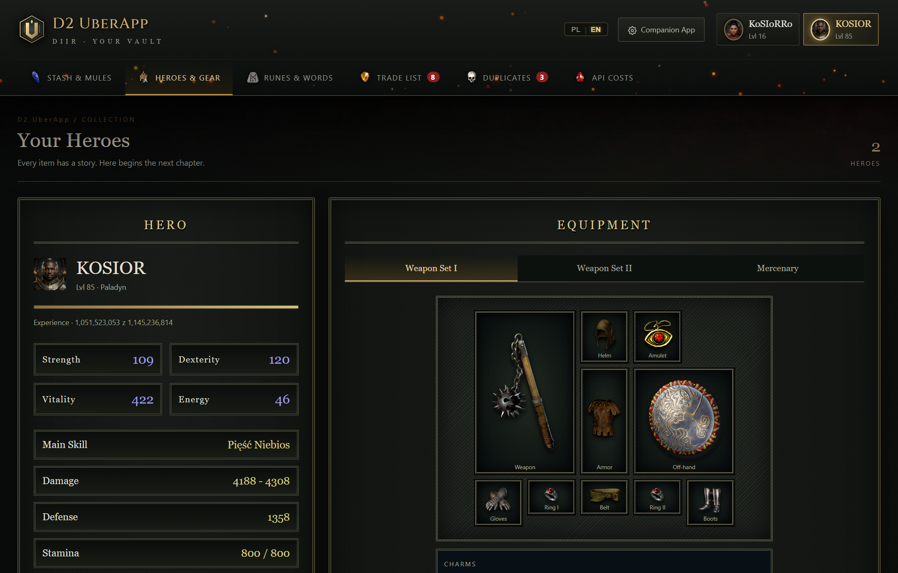
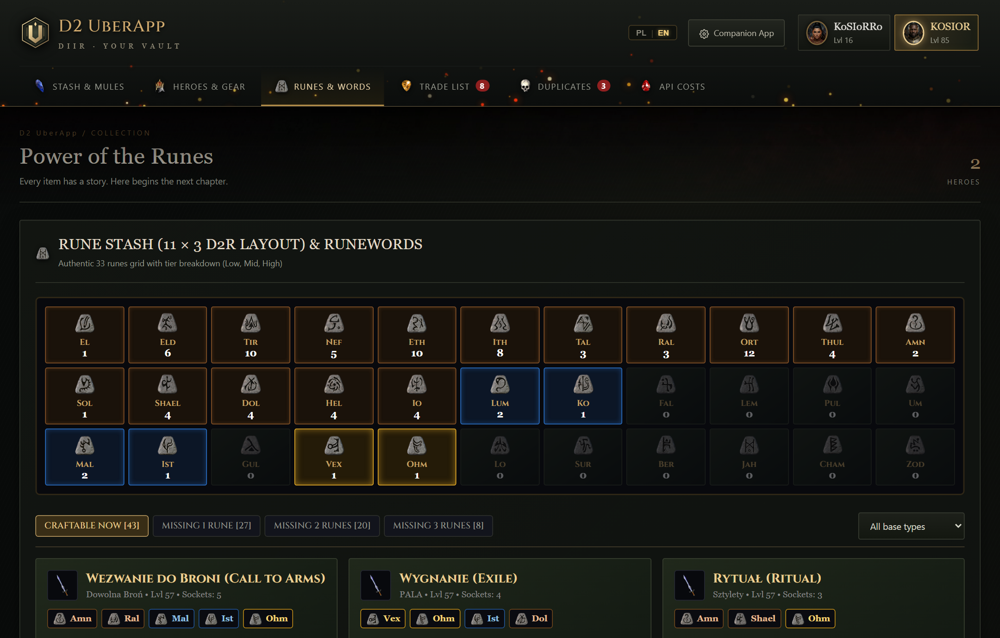
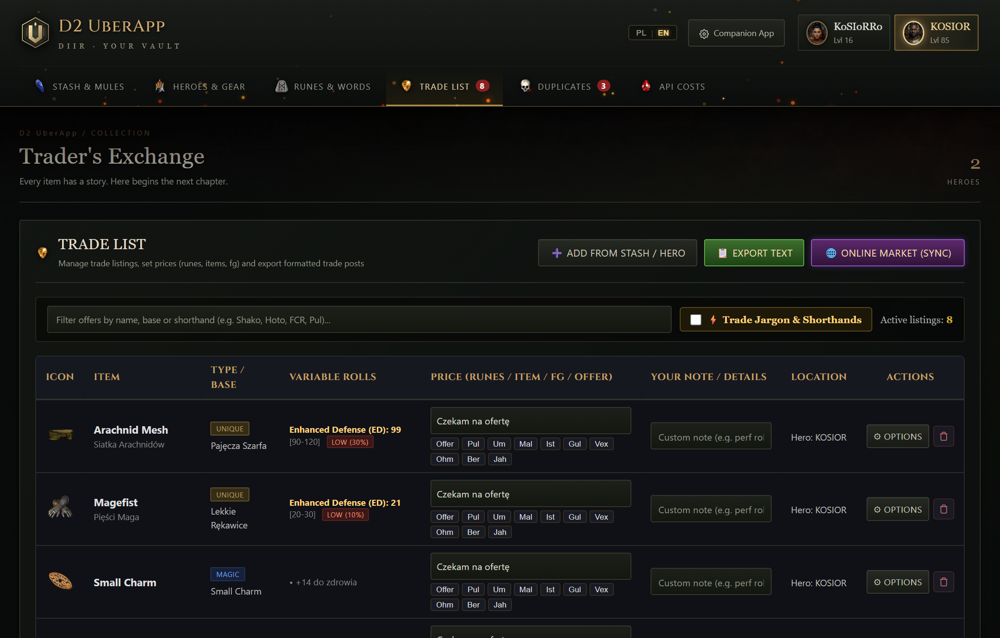
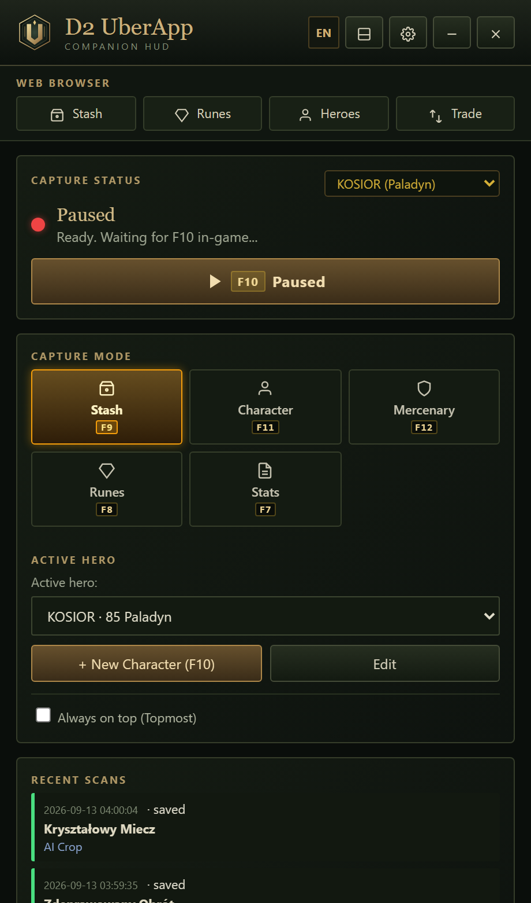
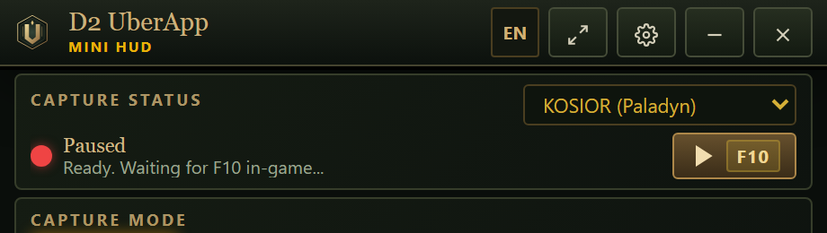

# D2 UberApp

<div align="center">

**AI-Powered Vault, Companion HUD & Trading Hub for Diablo II: Resurrected**  
*1-Click Item Export to Online Market & Instant Trade Listings (Świeża Beta Testowa) • 100% Anti-Ban Safe*

<br>

<p align="center">
  <a href="#english"></a>
  &nbsp;&nbsp;&nbsp;&nbsp;
  <a href="#wersja-polska"></a>
</p>

<p align="center">
  <a href="#english">
    
    <b> Read in English</b>
  </a>
  &nbsp;&nbsp;&nbsp;&nbsp;•&nbsp;&nbsp;&nbsp;&nbsp;
  <a href="#wersja-polska">
    
    <b> Czytaj po polsku</b>
  </a>
</p>

[](https://kosiorro.github.io/D2-UberApp/)
[](https://d2uberappmarket.tw5.org)
[-brightgreen.svg)](https://github.com/kosiorro/D2-UberApp/releases)
[](#beta-notice)
[-brightgreen.svg)](#account-safety-screenshot-based-architecture)
[](#gemini-api-key-required--free)
[](https://www.python.org/downloads/)
[](https://microsoft.com)
[](LICENSE)
[](#wersja-polska)

🌐 **[Live Website & Guide](https://kosiorro.github.io/D2-UberApp/)** • ⚖️ **[Community Online Market](https://d2uberappmarket.tw5.org)** • 📦 **[Download Releases](https://github.com/kosiorro/D2-UberApp/releases)**

[English](#english) • [Wersja Polska](#wersja-polska) • [How to Use](#how-to-use) • [Screenshots](#visual-tour) • [Download](#download-and-installation) • [Safety](#account-safety-screenshot-based-architecture) • [API Setup](#gemini-api-key-required--free) • [Hotkeys](#controls--hotkeys) • [Roadmap](#roadmap--planned-features)

</div>

---

<a name="english"></a>
## English Documentation

> 🇵🇱 *Wolisz język polski? [Przejdź do wersji polskiej ➔](#wersja-polska)*

### Official Links & Services
- 🌐 **Live Website & Interactive Guide**: [https://kosiorro.github.io/D2-UberApp/](https://kosiorro.github.io/D2-UberApp/)
- ⚖️ **Community Trading Hub (Online Market)**: [https://d2uberappmarket.tw5.org](https://d2uberappmarket.tw5.org)
- 📦 **Releases & Pre-built Binaries**: [https://github.com/kosiorro/D2-UberApp/releases](https://github.com/kosiorro/D2-UberApp/releases)
- 💻 **Source Code Repository**: [https://github.com/kosiorro/D2-UberApp](https://github.com/kosiorro/D2-UberApp)

### Beta Notice
> **Active Beta Status**: D2 UberApp is currently in active beta testing. Core features are fully functional, with continuous optimizations, balance tuning, and community feedback integration in progress.

<a name="how-to-use"></a>
### 🎮 How to Use in Diablo II: Resurrected (Step-by-Step)

Getting started takes less than 2 minutes. No technical experience required!

| Step | Action | Description |
|:---:|:---|:---|
| **1** | **Launch App** | Install via **`D2UberApp_Setup_v1.0.0.exe`** (or extract the portable zip and run **`Launch_D2_UberApp.bat`** / `D2UberApp.exe`). The local server starts and opens your vault at `http://127.0.0.1:5005`. |
| **2** | **Hover Item in D2R** | In Diablo II: Resurrected, simply **hover your mouse cursor** over any item in your inventory, stash, or on the ground so its stat tooltip is clearly visible. |
| **3** | **Press F10** | Press the **`F10`** hotkey directly in-game (no Alt-Tab needed!). An audio chime confirms capture, and Google Gemini AI evaluates all stats & variable rolls in ~1.2s. |
| **4** | **Check Rolls & Export** | Inspect variable roll tiers (`PERFECT 100%`, `HIGH`, `MID`, `LOW`). Click **"Export to Market"** to instantly create a live listing on [d2uberappmarket.tw5.org](https://d2uberappmarket.tw5.org) with 1 click. |

> 💡 **ProTip**: The `F10` hotkey is global across Windows. You never need to click or focus the companion window before scanning.

### Account Safety (Screenshot-Based Architecture)
> **100% Account Safety**: D2 UberApp operates in complete isolation from the game process.
>
> - **Screenshot-Only Operation**: The application captures pixels purely via the standard Windows Desktop API (`BitBlt` / Desktop Duplication) upon pressing your hotkey.
> - **Zero Process Memory Reading**: D2 UberApp never inspects, hooks, or scans the memory space of `D2R.exe`.
> - **Zero Code or DLL Injection**: No external DLLs are injected into the game process, and game files remain untouched.
> - From the perspective of Blizzard's anti-cheat systems (Warden), D2 UberApp operates identically to desktop tools such as **OBS Studio**, **Snipping Tool**, or **Discord Screen Share**.

### Gemini API Key (Required & Free)
> **A Google Gemini API key is required for optical character recognition and item evaluation.**
>
> - **100% Free of Charge**: You can obtain an API key for **Google Gemini 3.5 Flash Lite** at [Google AI Studio](https://aistudio.google.com/) with no credit card required.
> - The free tier quota generously supports thousands of scans per month.
> - Set your key in `.env` (`GEMINI_API_KEY="..."`) or directly within the Companion HUD settings window.

---

### Key Features

1. **Zero Alt-Tab In-Game Capture (F10)**:
   - High-speed Win32 hotkey capture of item tooltips directly in Sanctuary.
   - Smart cropping, dual-language OCR, and catalog validation complete in ~1.2s with audio confirmation.

2. **Canonical Variable Roll Rating**:
   - Matches items against an embedded canonical database (`catalog.sqlite`).
   - Computes statistical percentile ratings for variable affixes (e.g. *Enhanced Defense*, *All Resistances*, *Magic Find*): `PERFECT (100%)`, `HIGH`, `MID`, `LOW`.

3. **Hero Equipment & Gear Manager**:
   - Visual equipment view for all 7 character classes.
   - Weapon swap support (Slots I and II), mercenary equipment management, and charms inventory.

4. **11x3 Rune Stash & Runeword Calculator**:
   - Authentic 33-rune grid (El to Zod) with live inventory counts.
   - Real-time crafting calculator identifying assembleable runewords based on owned runes and socketed bases.

5. **Trader's Exchange & 1-Click Online Market Export (Fresh Test Beta / Świeża Beta Testowa)**:
   > 🧪 **Fresh Test Beta**: The online market sync and trading hub are brand-new features currently undergoing active beta testing. Core listing and export functionality are operational, with continuous optimizations in progress.
   - **1-Click Export to Online Market**: Export your scanned items straight into the public community marketplace ([d2uberappmarket.tw5.org](https://d2uberappmarket.tw5.org)) and create live trade listings in a single click with verified stats and roll evaluations.
   - Fast valuation in high runes and forum currency.
   - Automated shorthand jargon generation (e.g., *Hoto 40*, *Arach 120ED*, *CTA 6/6/4*).
   - Instant export formatted for Discord and forums.

6. **Desktop Companion HUD & Mini Mode**:
   - Lightweight always-on-top overlay with live scan feeds, active hero indicator, and hotkey mode switchers.

---

<a name="visual-tour"></a>
### Visual Tour & App Screenshots (Zrzuty Ekranu)

<div align="center">

#### 1. Wanderer's Vault (Skarbiec Przedmiotów)
*Responsive stash grid with quality filters, full-text affix search & hero filters.*  
*Główny widok skrytki z filtrami jakości, wyszukiwarką afiksów i filtrem postaci.*



<br><br>

#### 2. Item Detail Modal (Karta Przedmiotu & Widełki Rolls)
*In-game tooltip crop, base item properties, canonical roll percentile & valuation.*  
*Autentyczny wycinek tooltipu z gry, baza przedmiotu, ocena widełek i estymacja wartości.*



<br><br>

#### 3. Hero Equipment (Ekwipunek Bohaterów)
*Full equipment slots for 7 character classes, weapon swaps (I/II), mercenary gear & charms.*  
*Pełne sloty wyposażenia dla 7 klas postaci, zamiana broni (I/II), najemnik oraz inwentarz talizmanów.*



<br><br>

#### 4. 11x3 Rune Stash & Crafting (Siatka 33 Run i Słowa Runiczne)
*Authentic 33-rune stash grid with real-time assembleable runeword crafting calculator.*  
*Autentyczna skrytka 33 run (od El do Zod) z kalkulatorem słów runicznych gotowych do złożenia.*



<br><br>

#### 5. Trader's Exchange & 1-Click Market Export (Świeża Beta Testowa / Test Beta)
*1-click export to community online market (d2uberappmarket.tw5.org), trade shorthand generator & pricing (Fresh test beta).*  
*Eksport jednym kliknięciem do giełdy online (d2uberappmarket.tw5.org), generator żargonu handlowego i wycena (Świeża faza testów beta).*



<br><br>

#### 6. Desktop Companion HUD & Mini Mode (Nakładka w Grze)
*Always-on-top desktop overlay with sub-second F10 live scan feeds & discreet mini mode.*  
*Dyskretna nakładka Always-on-Top ze statusem skanowania F10 w czasie rzeczywistym i trybem mini.*

<p align="center">
  
  &nbsp;&nbsp;
  
</p>

</div>

---

### Roadmap & Planned Features

- **Remaining Items Support**: Full parsing and tracking for Uber Tristram keys (Key of Terror, Hate, Destruction), boss organs, essences, and Token of Absolution.
- **Skill Points & Synergy Calculator**: Interactive skill tree calculator, total +skills bonuses aggregation, and damage synergy calculations across equipped gear.
- **Alternative & Local AI Models**: Support for local open-source vision models via Ollama / LM Studio for 100% offline scanning, alongside alternative cloud AI providers.
- **Additional Languages**: Expansion of interface and OCR dictionary to German, French, Spanish, and Asian Diablo communities.
- **Bug Fixes & Continuous Polish**: Ongoing performance optimizations, edge-case crop improvements, and UI responsiveness enhancements.

---

### Controls & Hotkeys

All hotkeys are global and functional while Diablo II: Resurrected is the active foreground window:

| Hotkey | Mode / Action | Target & Outcome |
|:---:|:---|:---|
| **F10** | **Capture Target** | Captures the item tooltip under the cursor and queues it for AI evaluation. |
| **F7** | **Character Stats Mode** | Scans the character attribute screen to update level, attributes, and resistances. |
| **F8** | **Rune Stash Mode** | Scans the stash rune tab to update counts for all 33 runes. |
| **F9** | **Vault Stash Mode** | Sets the destination of subsequent F10 scans to the shared vault. |
| **F11** | **Active Hero Gear Mode** | Directs subsequent F10 scans into the active hero's equipment slots. |
| **F12** | **Mercenary Gear Mode** | Directs subsequent F10 scans into the mercenary equipment tab. |

---

<a name="download-and-installation"></a>
### Download & Installation (Wydania i Instalacja)

Choose the setup method that suits you best:

#### 🎮 Option 1: 1-Click Windows Setup Installer (Recommended for Players)
*Ideal for regular players &mdash; no Python or terminal needed!*
1. Download **`D2UberApp_Setup_v1.0.0.exe`** from [Latest Releases](https://github.com/kosiorro/D2-UberApp/releases).
2. Run the installer wizard ("Next, Next, Finish"). It will automatically create **Desktop & Start Menu shortcuts**.
3. Launch **D2 UberApp** from your Desktop shortcut!

#### 📦 Option 2: Standalone Portable ZIP (.zip)
*No installation required &mdash; works from any folder or USB stick.*
1. Download **`D2UberApp_Windows_x64.zip`** from [Latest Releases](https://github.com/kosiorro/D2-UberApp/releases).
2. Extract the archive into any folder.
3. Double-click **`Launch_D2_UberApp.bat`** (or `D2UberApp.exe`).

#### 💻 Option 3: Developer Setup (Git / Python 3.10+)
*For developers who want to inspect and modify the source code.*
1. **Clone repository**:
   ```bash
   git clone https://github.com/kosiorro/D2-UberApp.git
   cd D2-UberApp
   ```
2. **Install Python dependencies**:
   ```bash
   pip install -r requirements.txt
   ```
3. **Configure free Gemini API key**:
   - Copy `.env.example` to `.env`:
     ```bash
     copy .env.example .env
     ```
   - Insert your API key in `.env`:
     ```env
     GEMINI_API_KEY="your_actual_key_here"
     GEMINI_MODEL="gemini-3.5-flash-lite"
     ```
4. **Launch Application**:
   - Run launcher:
     ```bash
     Launch_D2_UberApp.bat
     ```
     *(or run `python app.py`)*
   - Open Web Vault at `http://127.0.0.1:5005` or Landing Page at `http://127.0.0.1:5005/landing`.

---

<a name="wersja-polska"></a>
## Wersja Polska (Dokumentacja PL)

> 🇬🇧 *Prefer English? [Switch to English documentation ➔](#english)*

### Oficjalne Linki i Serwisy
- 🌐 **Oficjalna Strona WWW i Przewodnik Online**: [https://kosiorro.github.io/D2-UberApp/](https://kosiorro.github.io/D2-UberApp/)
- ⚖️ **Internetowa Giełda Przedmiotów (Market)**: [https://d2uberappmarket.tw5.org](https://d2uberappmarket.tw5.org)
- 📦 **Pobieranie i Najnowsze Wydania (Releases)**: [https://github.com/kosiorro/D2-UberApp/releases](https://github.com/kosiorro/D2-UberApp/releases)
- 💻 **Repozytorium Kodu Źródłowego**: [https://github.com/kosiorro/D2-UberApp](https://github.com/kosiorro/D2-UberApp)

### Informacja o wersji Beta
> **Aktywna Faza Beta**: D2 UberApp znajduje się w fazie intensywnych testów beta. Główne moduły są w pełni sprawne, a kolejne usprawnienia i funkcje dochodzą na bieżąco.

### 🎮 Błyskawiczna Instrukcja Obsługi w Grze (Krok po Kroku)

Rozpoczęcie zajmuje mniej niż 2 minuty. Nie musisz znać się na programowaniu ani wpisywać żadnych komend!

| Krok | Czynność | Opis |
|:---:|:---|:---|
| **1** | **Uruchom aplikację** | Zainstaluj program za pomocą **`D2UberApp_Setup_v1.0.0.exe`** (lub rozpakuj paczkę ZIP i kliknij **`Launch_D2_UberApp.bat`** / `D2UberApp.exe`). Aplikacja wystartuje serwer i otworzy Twój skarbiec w przeglądarce (`http://127.0.0.1:5005`). |
| **2** | **Wskaż przedmiot w Sanktuarium** | W grze Diablo II: Resurrected **najedź kursorem myszy** na dowolny przedmiot w ekwipunku, skrytce lub na ziemi, tak aby na ekranie wyświetliło się okienko ze statystykami (tooltip). |
| **3** | **Wciśnij F10** | Wciśnij klawisz **`F10`** bezpośrednio w grze (bez wychodzenia do pulpitu!). Usłyszysz dźwięk potwierdzenia, a sztuczna inteligencja Gemini w ~1.2 sekundy odczyta statystyki i obliczy widełki rolli. |
| **4** | **Sprawdź widełki i wystaw 1-klikiem** | Sprawdź odznaki widełek (`PERFECT 100%`, `HIGH`, `MID`, `LOW`). Kliknij **„Eksportuj do marketu”**, aby jednym kliknięciem stworzyć zweryfikowaną ofertę na giełdzie [d2uberappmarket.tw5.org](https://d2uberappmarket.tw5.org). |

> 💡 **Wskazówka**: Klawisz `F10` działa globalnie w systemie Windows &mdash; nie musisz klikać ani aktywować okna aplikacji przed wykonaniem skanu!

### Bezpieczeństwo Konta (Architektura Screenshot-Only)
> **100% Bezpieczeństwa Konta — Pełna Izolacja Procesu**:
>
> - **Działanie wyłącznie na screenach**: Program wykonuje zrzut wybranego fragmentu pulpitu przez standardowe Windows API (`BitBlt`), identycznie jak **OBS Studio**, **Narzędzie Wycinanie** czy podgląd ekranu na **Discordzie**.
> - **Zero czytania pamięci gry**: Aplikacja nie skanuje i nie podpina się pod pamięć procesu `D2R.exe`.
> - **Zero wstrzykiwania kodu (DLL Injection)**: Żadne biblioteki ani haki nie są wprowadzane do procesu gry, a pliki D2R pozostają nienaruszone.
> - Dla systemu anty-cheat firmy Blizzard (Warden) aplikacja jest całkowicie pasywna i niewykrywalna.

### Darmowy Klucz Gemini API (Wymagany)
> **Do działania rozpoznawania przedmiotów AI wymagany jest klucz Google Gemini API.**
>
> - **W 100% darmowy**: Klucz do modelu **Google Gemini 3.5 Flash Lite** wygenerujesz bezpłatnie w [Google AI Studio](https://aistudio.google.com/) bez konieczności podawania karty kredytowej.
> - Darmowy pakiet obejmuje wysokie limity zapytań, które z dużym zapasem wystarczają na tysiące skanów w miesiącu.
> - Klucz wystarczy wpisać w pliku `.env` lub bezpośrednio w ustawieniach okna Companion HUD.

---

### Główne Możliwości
> 📸 *Wszystkie zrzuty ekranu z interfejsu aplikacji znajdziesz w sekcji [Galeria i Zrzuty Ekranu (#visual-tour)](#visual-tour).*

1. **Skanowanie w grze bez minimalizowania okna (F10)**:
   - Szybki skrót Win32 API przechwytujący tooltip bezpośrednio podczas rozgrywki.
   - Autokadrowanie, wielojęzyczny OCR oraz weryfikacja w katalogu w ~1.2s z dźwiękiem potwierdzenia.

2. **Weryfikacja i Ocena Widełek (Rolls)**:
   - Porównanie parametrów z kanoniczną bazą `catalog.sqlite`.
   - Procentowa ocena zmiennych cech unikatów, zestawów i runewords: `PERFECT (100%)`, `HIGH`, `MID`, `LOW`.

3. **Ekwipunek Bohatera i Wyposażenie**:
   - Kompletny widok slotów ekwipunku dla wszystkich 7 klas postaci.
   - Obsługa zamiany broni (Slot I oraz II), wyposażenie najemnika oraz inwentarz talizmanów.

4. **Siatka 33 Run (11x3) i Kalkulator Słów Runicznych**:
   - Autentyczny układ od runy El do Zod z licznikami posiadanych sztuk.
   - Kalkulator wskazujący słowa runiczne możliwe do złożenia z posiadanych run i baz.

5. **Trader's Exchange (Giełda Wymian) i Eksport 1-Kliknięciem do Marketu (Świeża Beta Testowa)**:
   > 🧪 **Świeża Beta Testowa**: Moduł giełdy online oraz automatycznej publikacji ofert to nowo wdrożona funkcja we wczesnej fazie testów beta. Baza i mechanizmy rynkowe są na bieżąco rozwijane i optymalizowane na podstawie opinii graczy.
   - **Eksport jednym kliknięciem do marketu**: Błyskawiczne wysyłanie zeskanowanych przedmiotów do publicznej giełdy online ([d2uberappmarket.tw5.org](https://d2uberappmarket.tw5.org)) i automatyczne tworzenie publicznych listingów ofert z weryfikacją widełek i ceną w HR.
   - Szybkie przypisywanie cen w runach i walucie forumowej.
   - Generator oficjalnego żargonu handlowego (np. *Hoto 40*, *Arach 120ED*).
   - Eksport gotowych formatowanych list na Discord i fora.

6. **Desktop Companion HUD i Tryb Mini**:
   - Lekkie okno nakładkowe Always-on-Top z podglądem skanów, aktywną postacią i skrótami trybów F7–F12.

---

### Plany Rozwoju (Do Zrobienia)

- **Reszta Przedmiotów (Ubery)**: Obsługa kluczy na Uber Tristram (Key of Terror, Hate, Destruction), organów bossów, esencji oraz Token of Absolution.
- **Przeliczanie Skilli**: Kalkulator drzewek umiejętności, agregacja bonusów `+All Skills` z ekwipunku oraz przeliczanie synergii bojowych.
- **Inne Modele AI i Działanie Lokalnie**: Możliwość uruchomienia lokalnych modeli wizyjnych (np. Ollama / LM Studio) do skanowania 100% offline.
- **Więcej Języków**: Dodanie kolejnych wersji językowych dla społeczności międzynarodowej (niemiecki, francuski, hiszpański, koreański).
- **Poprawki Błędów (Bagi) i Optymalizacje**: Ciągłe ulepszanie kadrowania nietypowych rozdzielczości oraz podnoszenie płynności działania.

---

### Tabela Skrótów Klawiszowych

| Skrót | Tryb / Akcja | Opis Działania |
|:---:|:---|:---|
| **F10** | **Przechwyć cel (Capture)** | Skanuje tooltip pod kursorem i przetwarza go przez Gemini AI. |
| **F7** | **Skan statystyk postaci** | Skanuje otwarte okno atrybutów bohatera i aktualizuje statystyki. |
| **F8** | **Skan zakładki run** | Skanuje skrytkę z runami i aktualizuje liczniki wszystkich 33 run. |
| **F9** | **Tryb skrytki ogólnej** | Przełącza cel zapisu kolejnych skanów F10 na wspólny skarbiec. |
| **F11** | **Tryb aktywnego bohatera** | Przełącza cel zapisu kolejnych skanów F10 na ekwipunek postaci. |
| **F12** | **Tryb najemnika** | Przełącza cel zapisu kolejnych skanów F10 na ekwipunek pomocnika. |

### Pobieranie i Instalacja

Wybierz najwygodniejszą dla siebie formę uruchomienia:

#### 🎮 Opcja 1: Instalator Windows (.exe) [Zalecane dla Graczy]
*Najprostsza opcja &mdash; zero wpisywania komend, instalator zajmuje się wszystkim!*
1. Pobierz plik **`D2UberApp_Setup_v1.0.0.exe`** ze strony [Najnowsze Wydania (Releases)](https://github.com/kosiorro/D2-UberApp/releases).
2. Uruchom instalator („Dalej, Dalej, Gotowe”) &mdash; instalator utworzy **skrót na Pulpicie i w Menu Start**.
3. Uruchamiaj aplikację bezpośrednio ze skrótu na Pulpicie!

#### 📦 Opcja 2: Paczka Przenośna Portable ZIP (.zip)
*Dla osób ceniących wersje portable bez instalacji w systemie.*
1. Pobierz plik **`D2UberApp_Windows_x64.zip`** z [Releases](https://github.com/kosiorro/D2-UberApp/releases).
2. Rozpakuj archiwum do dowolnego folderu (np. na Pulpit lub pendrive).
3. Kliknij dwukrotnie **`Launch_D2_UberApp.bat`** (lub `D2UberApp.exe`).

#### 💻 Opcja 3: Kod Źródłowy (Python 3.10+ / Git)
*Dla pasjonatów i programistów chcących modyfikować kod.*
1. Sklonuj repozytorium:
   ```bash
   git clone https://github.com/kosiorro/D2-UberApp.git
   cd D2-UberApp
   ```
2. Zainstaluj biblioteki: `pip install -r requirements.txt`
3. Skonfiguruj `.env` podając swój bezpłatny klucz `GEMINI_API_KEY`.
4. Uruchom skrypt: `Launch_D2_UberApp.bat` (lub `python app.py`).

---

### Licencja i Zastrzeżenia

Diablo II: Resurrected jest zarejestrowanym znakiem towarowym Blizzard Entertainment, Inc. Aplikacja D2 UberApp jest projektem fanowskim open-source, niepowiązanym z Blizzard Entertainment. Program działa wyłącznie na zrzutach ekranu Windows API i nie modyfikuje plików gry. Dystrybucja na licencji MIT.
