<div align="center">


<br>

**AI-powered companion app for Diablo II: Resurrected**

Scan items, characters, stats, skills, runes and more directly from the game.

<br>

<a href="#wersja-polska"> <strong>Polski</strong></a>&nbsp;&nbsp;&nbsp;&nbsp;&nbsp;&nbsp;<a href="#english"> <strong>English</strong></a>

<br><br>

[](https://github.com/kosiorro/D2-UberApp/releases)
[](https://github.com/kosiorro/D2-UberApp/releases)
[](#status-projektu)
[](LICENSE)

</div>

<br>

<div align="center">
  <a href="https://youtu.be/yzvSY37K42A">
    
  </a>
  <p><a href="https://youtu.be/yzvSY37K42A"><strong>▶ Obejrzyj film na YouTube / Watch the video on YouTube</strong></a></p>
</div>

<br>

<div align="center">
  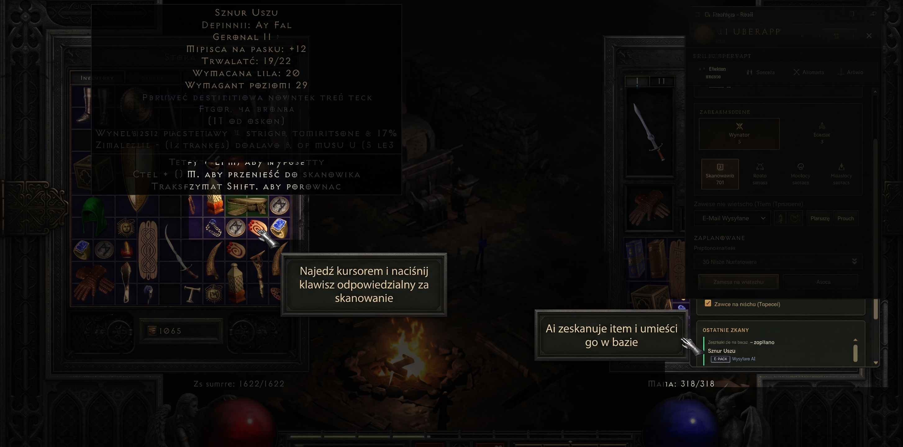
</div>

---

<a name="wersja-polska"></a>

# Wersja Polska

> [!NOTE]
> **Wymagany darmowy klucz Gemini API**
>
> Do działania funkcji analizy AI wymagany jest darmowy klucz **Google Gemini API**.
>
> **Jak pobrać klucz (zajmuje ok. minutę):**
> 1. Wejdź na stronę [Google AI Studio](https://aistudio.google.com/).
> 2. Zaloguj się kontem Google.
> 3. Kliknij **Get API key** lub **Create API key**.
> 4. Skopiuj wygenerowany klucz.
> 5. Wklej klucz w aplikacji w ustawieniach w polu **Klucz API Gemini** lub ustaw zmienną środowiskową `GEMINI_API_KEY`.
>
> *Darmowy limit (Free tier) Gemini API w zupełności wystarcza do codziennego korzystania z aplikacji.*

## O aplikacji

**D2 UberApp** to aplikacja pomocnicza do **Diablo II: Resurrected**, która analizuje obraz z gry i automatyzuje zbieranie informacji o Twoich postaciach oraz przedmiotach.

Możesz skanować:

- przedmioty i ich statystyki,
- postać i statystyki bohatera,
- pełny ekwipunek postaci,
- wyposażenie najemnika,
- skille i drzewka umiejętności,
- runy, klejnoty i materiały,
- zawartość skrytki.

## Najważniejsze możliwości

**Skanowanie przedmiotów** — odczyt tooltipu, rozpoznanie przedmiotu, statystyk i zmiennych rolli oraz zapis do własnej bazy.

**Ocena rolli** — automatyczne porównanie zmiennych parametrów z dostępnymi zakresami, np. `PERFECT`, `HIGH`, `MID`, `LOW`.

**Skanowanie postaci** — klasa, poziom, atrybuty, odporności i pozostałe statystyki bohatera.

**Kreator postaci** — prowadzi przez skanowanie wyposażenia, plecaka, najemnika oraz drzewek umiejętności.

**Postacie i ekwipunek** — kompletne profile bohaterów z wyposażeniem, bonusami z itemów oraz skillami.

**Runy i słowa runiczne** — automatyczne zliczanie run od El do Zod i podpowiedzi, które runewordy możesz aktualnie stworzyć.

**Materiały** — skanowanie kluczy, organów, esencji, odłamków i innych materiałów przechowywanych w skrytce.

**Skarbiec** — własna baza zeskanowanych przedmiotów z filtrowaniem, widokiem kart i tabelą.

**Trading / Market** — integracja ze sklepem [D2 UberApp Market](https://market.d2app.xyz): tworzenie list online jednym kliknięciem, synchronizacja przedmiotów oraz udostępnianie list przez link.

> [!WARNING]
> Moduł marketu jest nadal rozwijany i znajduje się w fazie beta.

## Jak działa skanowanie?

D2 UberApp analizuje to, co jest widoczne na ekranie. Aplikacja nie odczytuje pamięci procesu `D2R.exe`, nie wykonuje DLL Injection i nie modyfikuje plików Diablo II: Resurrected.

## Instalacja

1. Wejdź do [Releases](https://github.com/kosiorro/D2-UberApp/releases).
2. Pobierz najnowszą wersję aplikacji.
3. Zainstaluj ją lub uruchom wersję Portable.
4. Dodaj swój klucz Gemini API w ustawieniach.
5. Uruchom Diablo II: Resurrected i rozpocznij skanowanie.

### Uruchomienie z kodu źródłowego

```bash
git clone https://github.com/kosiorro/D2-UberApp.git
cd D2-UberApp
pip install -r requirements.txt
```

Ustaw klucz:

```env
GEMINI_API_KEY="twoj_klucz"
```

## Linki

- [Strona projektu](https://kosiorro.github.io/D2-UberApp/)
- [Najnowsze wydania](https://github.com/kosiorro/D2-UberApp/releases)
- [D2 UberApp Market](https://market.d2app.xyz)
- [Repozytorium GitHub](https://github.com/kosiorro/D2-UberApp)

<a name="status-projektu"></a>

## Status projektu

D2 UberApp jest aktywnie rozwijanym projektem w fazie **Beta**.

---

<a name="english"></a>

# English

> [!NOTE]
> **Free Gemini API key required**
>
> AI analysis features require a free **Google Gemini API** key.
>
> **How to get your key — it takes about a minute:**
> 1. Open [Google AI Studio](https://aistudio.google.com/).
> 2. Sign in with your Google account.
> 3. Click **Get API key** or **Create API key**.
> 4. Copy the generated key.
> 5. Paste it into the **Gemini API Key** field in D2 UberApp settings or set the `GEMINI_API_KEY` environment variable.
>
> *The Gemini API Free tier is sufficient for normal everyday use of the application.*

## About

**D2 UberApp** is a companion application for **Diablo II: Resurrected** that analyzes the game screen and automates collecting information about your characters and items.

You can scan:

- items and item stats,
- character statistics,
- complete character equipment,
- mercenary equipment,
- skills and skill trees,
- runes, gems and materials,
- stash contents.

## Main features

**Item scanning** — reads the item tooltip, recognizes item data and variable rolls, then saves it to your own vault.

**Roll evaluation** — compares variable stats with their available ranges and rates them as `PERFECT`, `HIGH`, `MID` or `LOW`.

**Character scanning** — reads class, level, attributes, resistances and other character statistics.

**Character Wizard** — guides you through scanning equipment, inventory, mercenary gear and skill trees.

**Characters & equipment** — complete character profiles with gear, item bonuses and skills.

**Runes & Runewords** — automatically tracks all runes from El to Zod and shows which runewords can currently be crafted.

**Materials** — scans keys, organs, essences, Worldstone shards and other materials stored in D2R.

**Vault** — your own database of scanned items with filters, card view and table view.

**Trading / Market** — integration with the [D2 UberApp Market](https://market.d2app.xyz): create online lists with one click, synchronize items and share lists via a link.

> [!WARNING]
> The online market module is still under development and currently in beta.

## How does scanning work?

D2 UberApp analyzes what is visible on your screen. It does not read `D2R.exe` process memory, does not use DLL Injection and does not modify Diablo II: Resurrected files.

## Installation

1. Open [Releases](https://github.com/kosiorro/D2-UberApp/releases).
2. Download the latest application release.
3. Install it or use the Portable version.
4. Add your Gemini API key in Settings.
5. Launch Diablo II: Resurrected and start scanning.

### Run from source

```bash
git clone https://github.com/kosiorro/D2-UberApp.git
cd D2-UberApp
pip install -r requirements.txt
```

Set your key:

```env
GEMINI_API_KEY="your_key"
```

## Links

- [Project website](https://kosiorro.github.io/D2-UberApp/)
- [Latest releases](https://github.com/kosiorro/D2-UberApp/releases)
- [D2 UberApp Market](https://market.d2app.xyz)
- [GitHub repository](https://github.com/kosiorro/D2-UberApp)

## Project status

D2 UberApp is an actively developed **Beta** project.

---

# Screenshots

### Online shop lists / Listy sklepu online

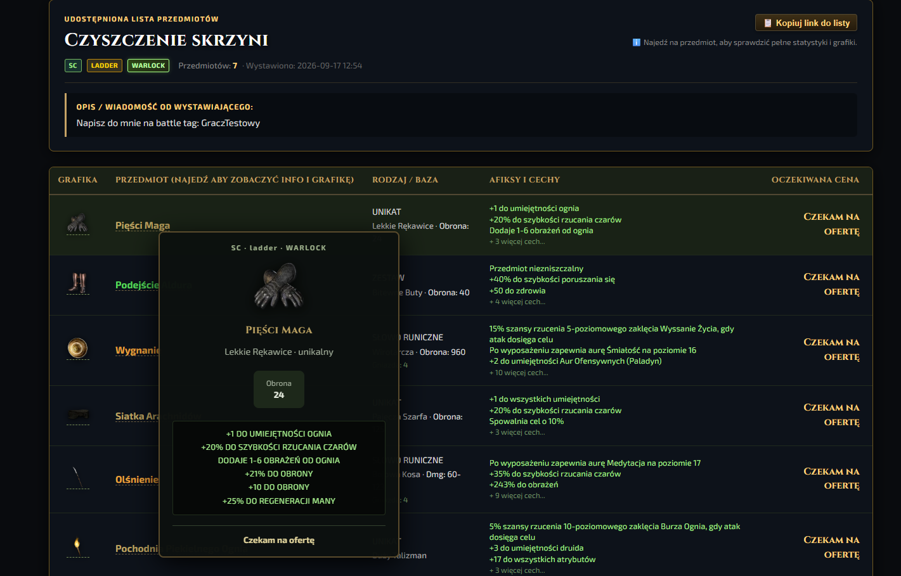

### Character statistics scanning / Skanowanie statystyk postaci

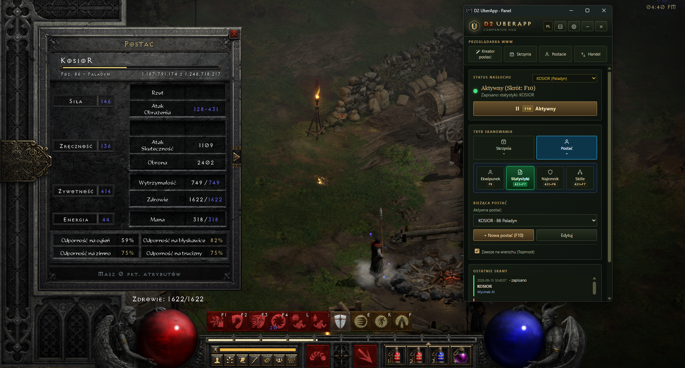

### Item scanning and Companion Panel / Skanowanie przedmiotu

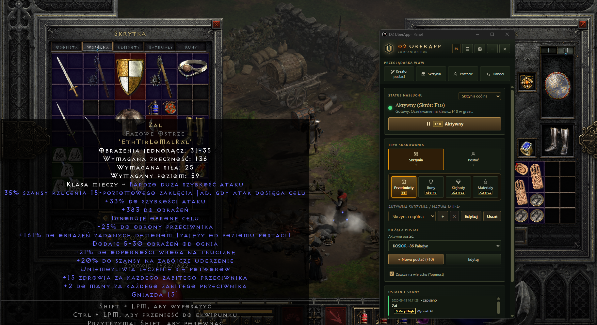

### Character scanning wizard / Kreator skanowania postaci

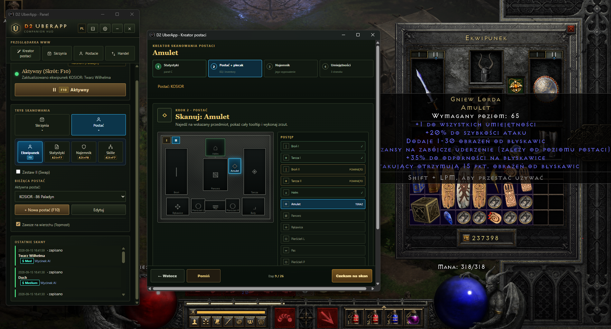

### Character, equipment and skill trees / Postać, ekwipunek i skille

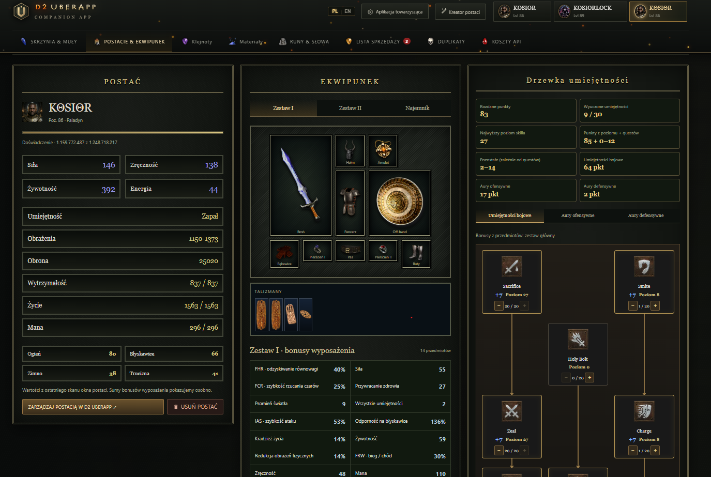

### Item Vault — card view / Skarbiec kafelkowy

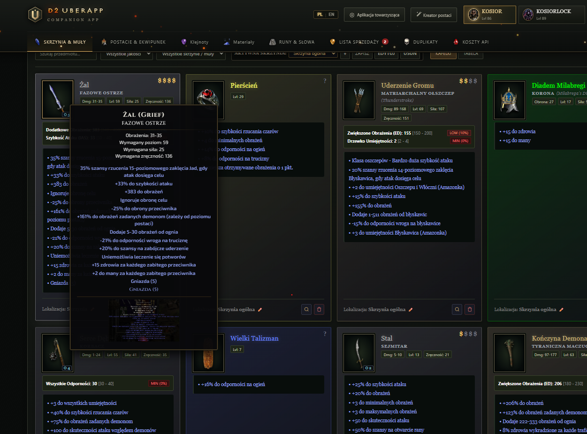

### Item Vault — table view / Skarbiec tabelaryczny

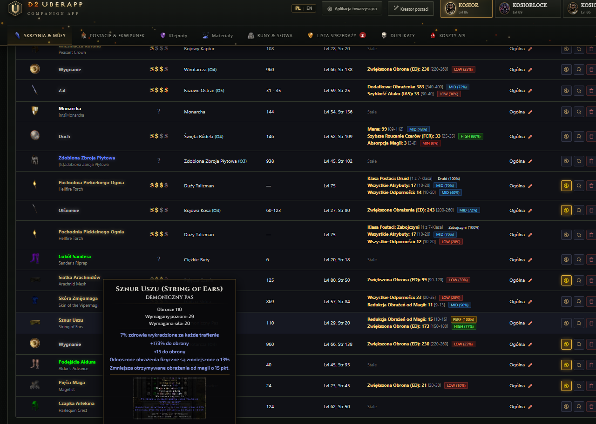

### Character Wizard — equipment scan / Skanowanie ekwipunku

<div align="center">
  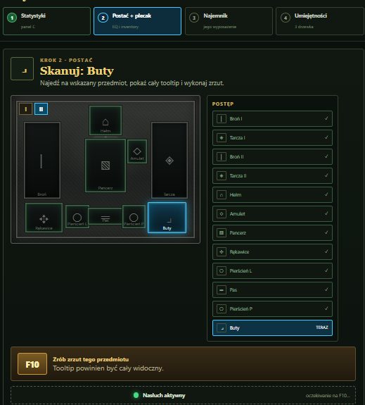
</div>

### Materials / Materiały

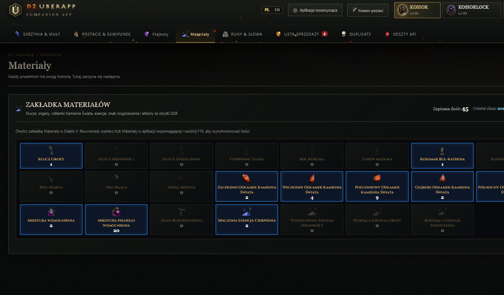

### Rune scanning / Skanowanie run

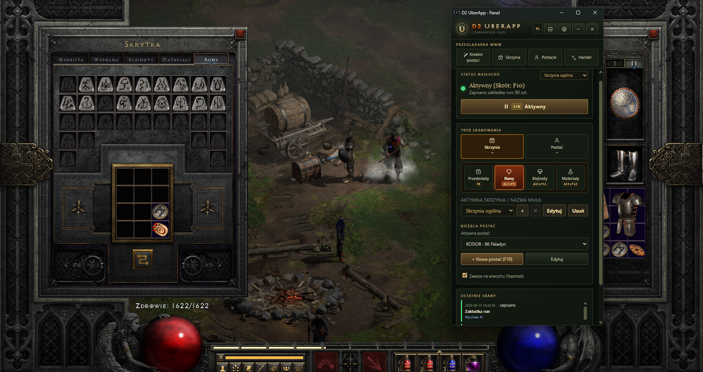

### Runes and Runewords / Runy i słowa runiczne

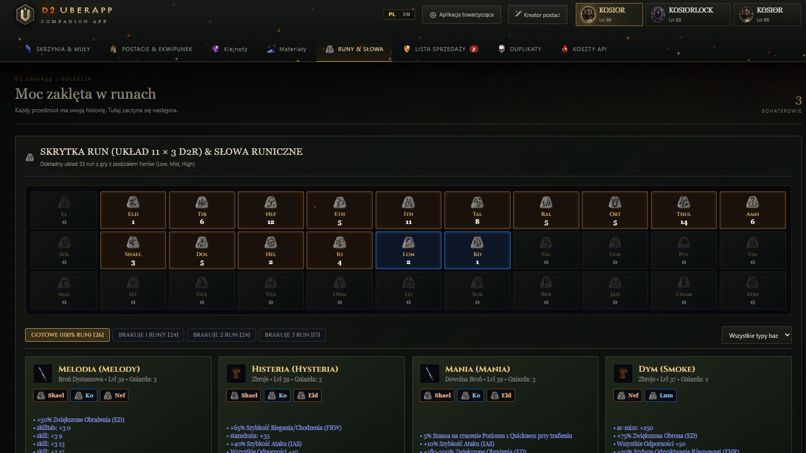

---

## License

The project is distributed under the **MIT License**.

Diablo II: Resurrected is a trademark of Blizzard Entertainment, Inc.

**D2 UberApp is an independent fan-made project and is not affiliated with or sponsored by Blizzard Entertainment.**
